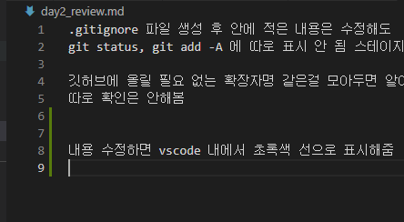

- "/.gitignore/" 파일 생성 후 안에 적은 내용은 수정해도
    git status, git add -A 에 따로 표시 안 됨 스테이지로 안 옮겨짐

- 깃허브에 올릴 필요 없는 확장자명 같은걸 모아두면 알아서 걸러주는듯
- 파일이 아니라 수식어처럼 내용 앞에 .gitignor이런식으로 붙여도 바로 뒷 문장을 생략해주는 듯
- 따로 확인은 안해봤음

- 내용 수정하면 vscode 내에서 초록색 선으로 표시해줌

 

